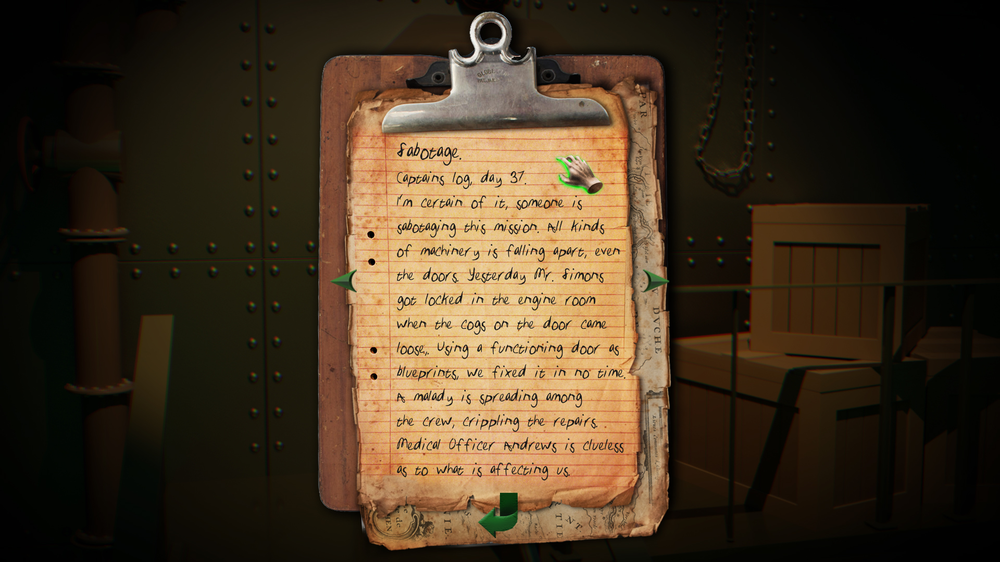
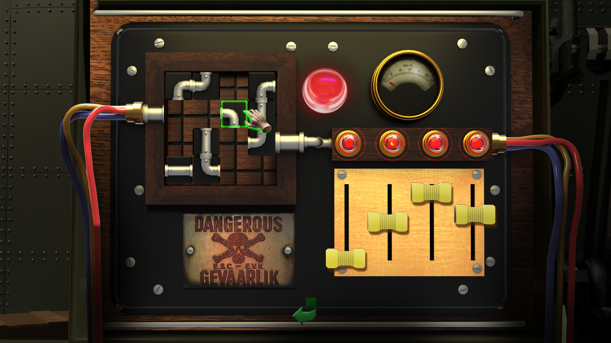
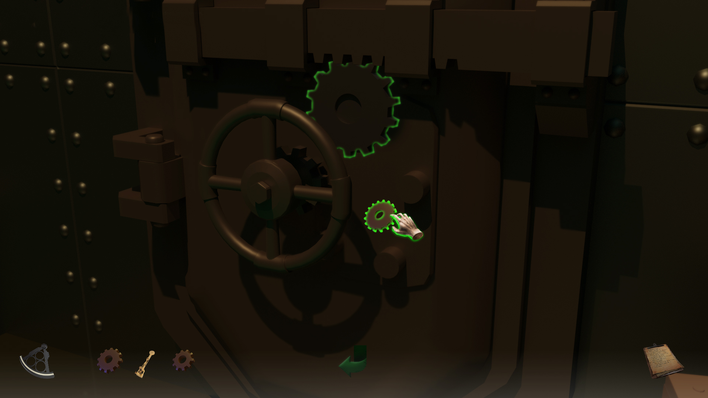

## Trailer

<iframe src='https://www.youtube.com/embed/x8qRmoPwuxQ' frameborder='0' allowfullscreen></iframe>

## Project Details
- 2D Point and Click
- 8 weeks half-time
- Made in the Löve2D framework for lua

## Contributions
- **Shaders** - I implemented several shader effects, such as chromatic aberration and vignette.
- **Framework** - I set up frameworks for being able to store all item ID's and information about an item in a database, as well as doing the same for audio, so that we could write more modular code in theory.
- **Particles** - I worked with Löve2D's particle system to create some awesome particles in our game.
- **Tools** - I set up a bunch of helper functions for audio and effects.

## Screenshots
---

