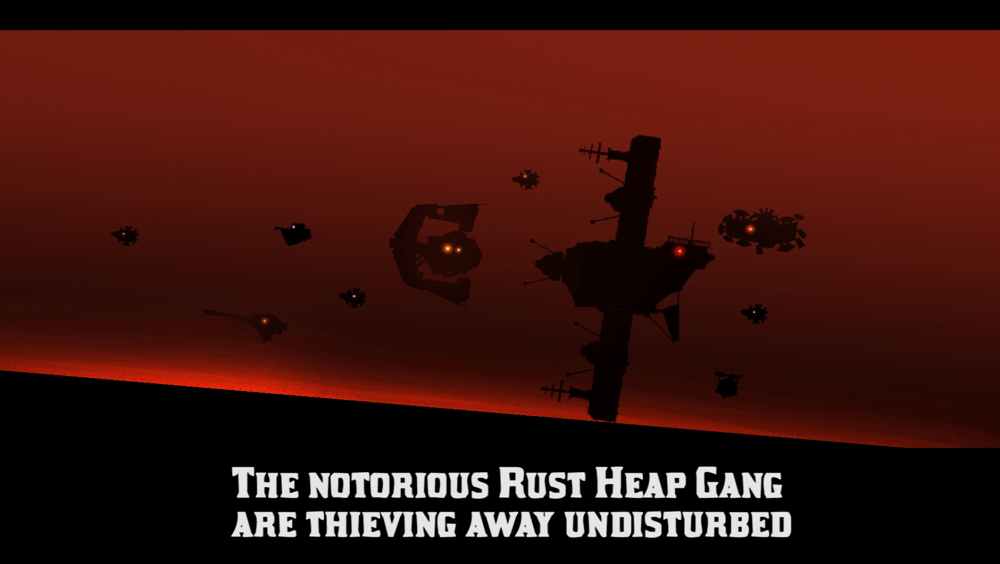
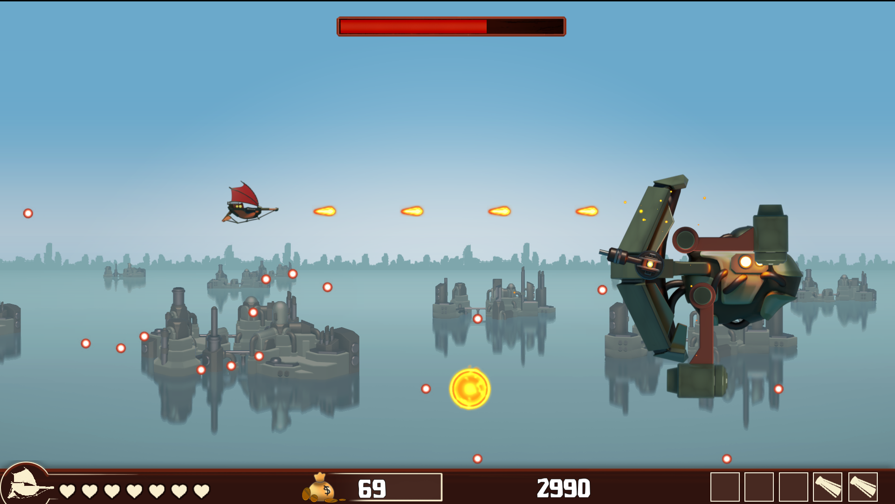
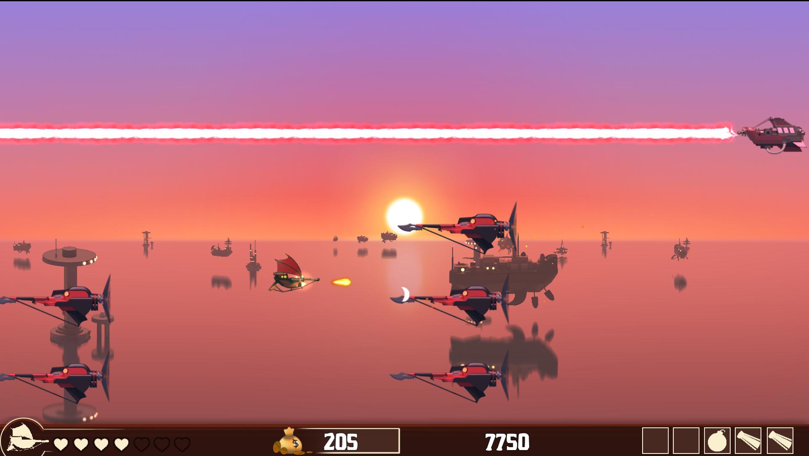
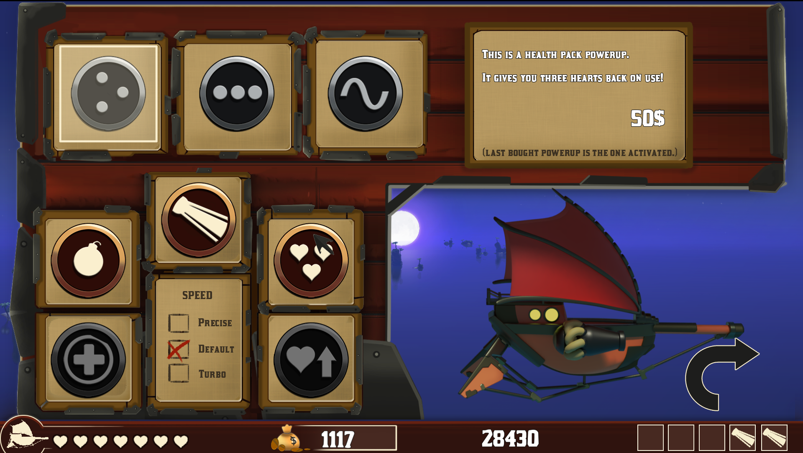
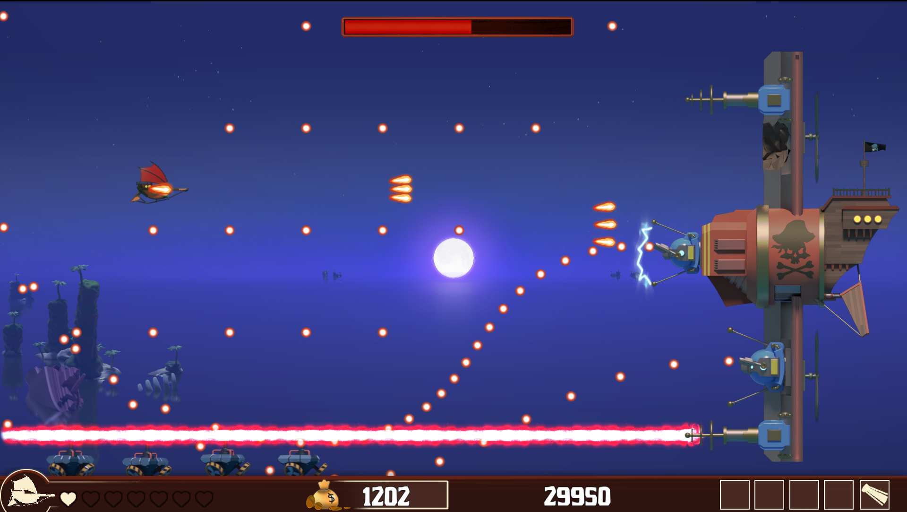

## Trailer

<iframe src='https://www.youtube.com/embed/nXtijQSuhs8' frameborder='0' allowfullscreen></iframe>

## Project Details
- 2D Shoot em Up
- 8 weeks half-time
- Made with an our house 2D C++ engine

## Contributions
- **Player** - I wrote the player and all the weapons you could use.
- **UI** - I implemented all the UI and 'juicy' effects such as easings and shaking. 
- **Shop** - I implemented the whole shop system, both how it works internally and all the UI for it.
- **Bosses** - I implemented the final boss as well as helped work on the other bosses along with another programmer.

## Screenshots

