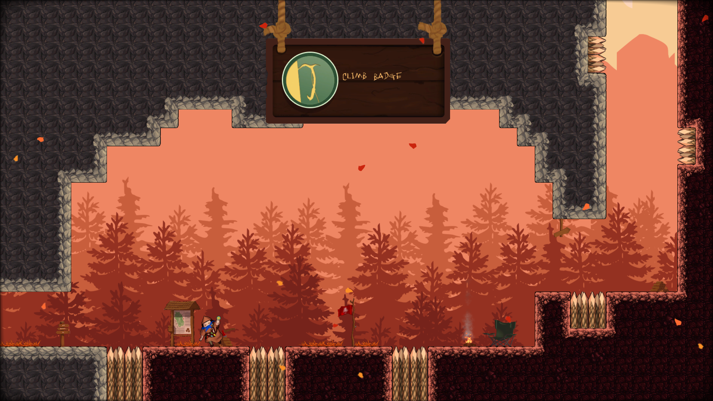
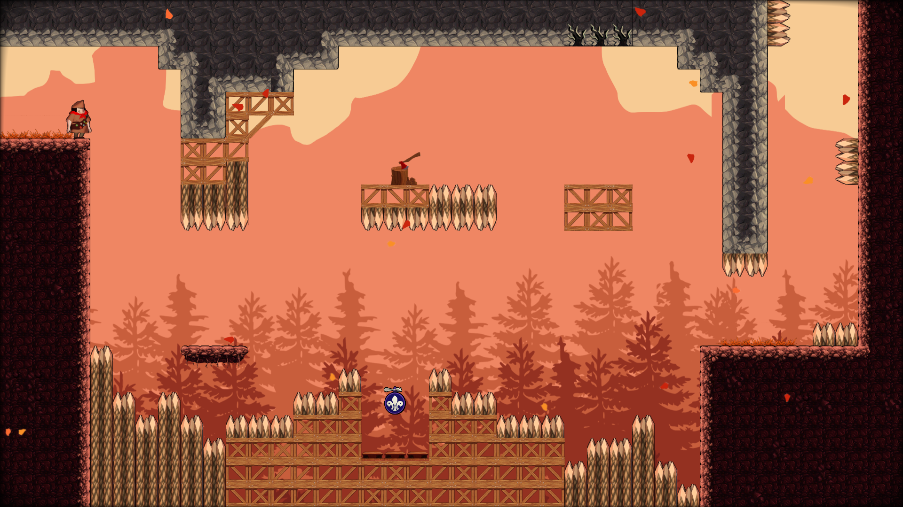
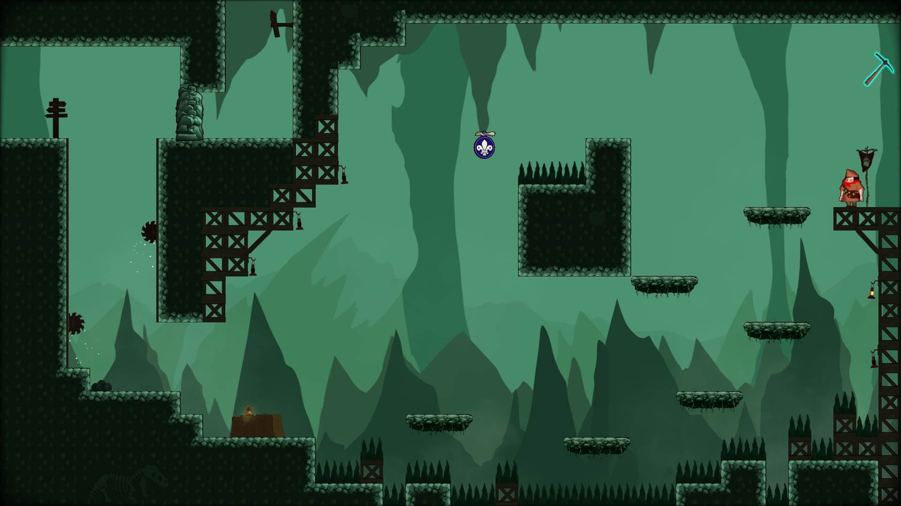
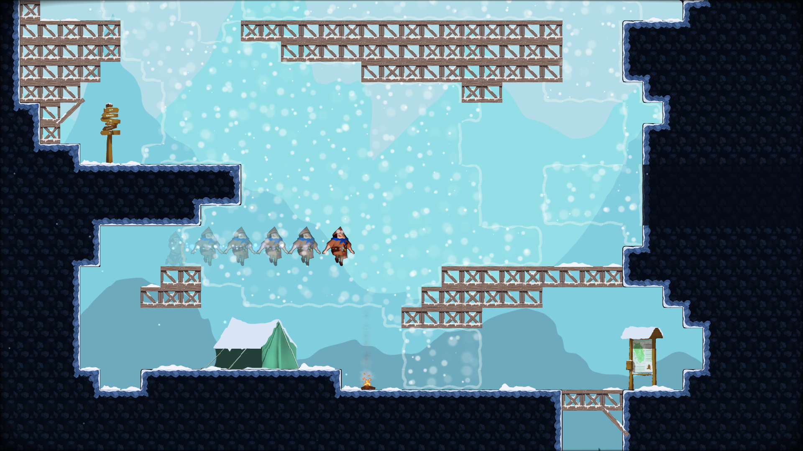
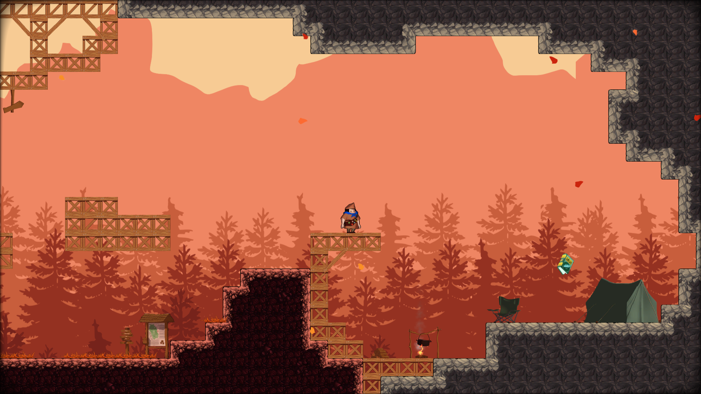

## Trailer

<iframe src='https://www.youtube.com/embed/oSd9YIrzHpo' frameborder='0' allowfullscreen></iframe>

## Project Details
- 2D Top down adventure game
- 8 weeks half-time
- Made with an our house 2D C++ engine

## Contributions
- **Player** - I wrote the player and tweaked all the metrics to match our reference game Celeste.
- **Rendering** - I wrapped our sprite class and set up a renderer to handle all the separate shaders and layers that sprites would be in.
- **Camera** - I wrote the camera and frustum culling we used for tiles.
- **Particle System** - I wrote a particle system based on [Löve2D](https://love2d.org/)'s interface with support for hot-loading and many tweakable parameters such as radial acceleration and tangential velocity.
- **Post Processing** - I implemented a shockwave shader effect when dashing, and also added several post processing effects such as chromatic aberration and a grayscale filter

## Screenshots

