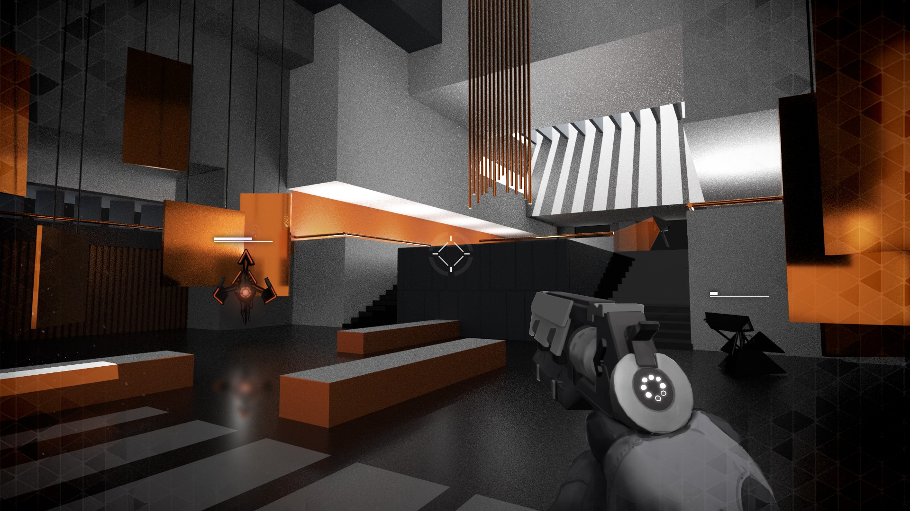

Potential is a First-Person Shooter game that our team made in 10 weeks half time.

## Contributions
- Screen Space Reflections [read more](/SSR/)
- Volumetric Lighting
- Area Lights
- Optimization of Rendering

I personally contributed to this game project on the rendering and vfx side of things, as I primarily worked with artists and technical artists to achieve the look we were going for. 
To achieve a similar look to this mockup I had to spend time implementing Screen-Space Reflections and learning how people use it in their games.
This has allowed our artists to match our style greatly and I feel that I've learned a bunch of stuff whilst researching techniques for SSR.

I also wrote a CPU-based particle system from scratch during the later weeks in this project as we felt we needed a more solid particle implementation to allow our artists to get their vision across.