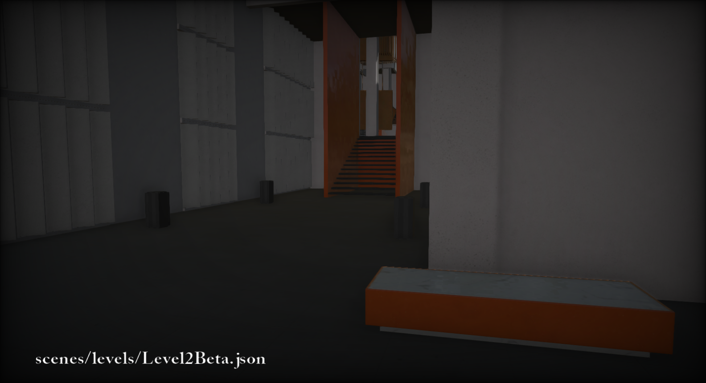
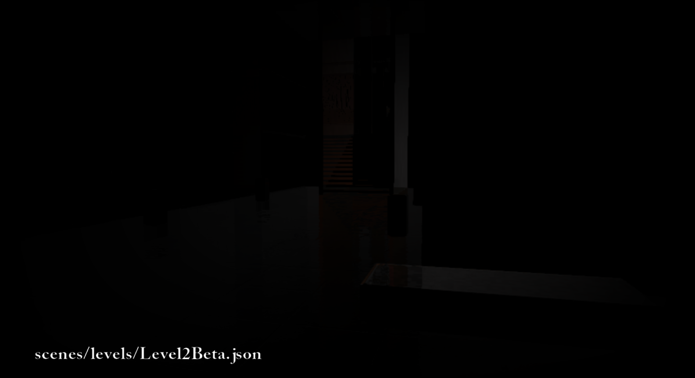
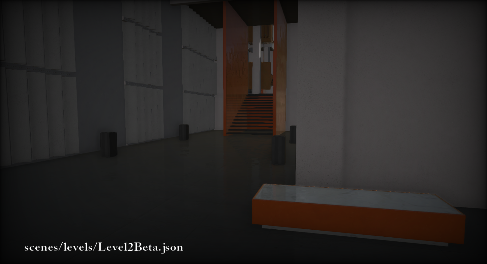

In the game [Potential](/Potential/) our artists wanted to have shiny floors with reflections of enemies and such, so I set out to implement Screen Space Reflections into our engine, as I felt that would be a cool addition and would solve this problem excellently.

The idea is that we grab the direction to the pixel, reflect it off of the normal of that pixel, set the position to the pixel's position and then step a bit and compare depth until we finally hit something, and then we are free to grab the color of the pixel that we hit.

Our scene starts out looking like this: 



Here is an example scene from our game with no SSR, so let's make that look nicer!

On to the shader:

```glsl
//sample data from g-buffer
float3 position = PositionTexture.Sample(sampler, input.uv).xyz;
float3 normal = NormalTexture.Sample(sampler, input.uv).xyz;

//in my case they were in world space so I convert them to view space...
float3 viewPos = mul(view, float4(position, 1.0)).xyz;
float3 viewNormal = mul(view, float4(normal, 0.0)).xyz;

//reflect vector with pixel normal
float3 reflection = reflect(position, normal);
```

I get a view position and view normal and then calculate the reflection vector off of that information.

```glsl
float3 step = reflection;
float3 newPosition = position + step;

for(int i = 0; i < loops; ++i)
{
    //grab new position and convert to post projection space
    float4 vPos = float4(viewPos, 1.0);
    float4 samplePosition = mul(projection, vPos);

    // adjust from NDC to DirectX space..
    samplePosition.xy = (samplePosition.xy / samplePosition.w) * float2(0.5, -0.5) + 0.5;

```

Then I calculate the new view position and transform it into post projection space and correct it for DirectX.

```glsl
    float currentDepth = abs(vPos.z);
    //I multiply with far plane because we have our depth stored linearly by using viewPos.z / farPlane
    float sampleDepth = abs(DepthTexture.Sample(sampler, samplePosition.xy).w * farPlane); 

    //if depth is close enough then sample pixel color
    if (abs(samplePosition.z - sampleDepth) < 0.001)
    {
        outputColor = ColorTexture.Sample(sampler, samplePosition.xy).xyz;
    }

    //else keep stepping
    step *= 1.0 - 0.5 * max(sign(currentDepth - sampleDepth), 0.0); //progress the step
    newPosition += step * (sign(sampleDepth - currentDepth) + 0.000001); //set new position and loop again
    outputColor = float3(0,0,0);
}
```

Finally we compare depth and return the color *(or if you want, UV)* and keep stepping until we either hit something or just return nothing.

If you were to draw the outputColor to the screen it would (hopefully) look something like this:



All that remains is to perform a simple additive blend with the scene using this information, and you will have something like this:



That's the gist of the SSR implementation, with some edge fading and such applied in our actual engine but left out for the simplicity of this post.

## Improvements
If you have some performance to space you might look into blurring the reflections depending on the surface, either by performing a blur (say, bilateral blur) or by cone-tracing instead of ray tracing in the case that the surface is rougher, as that might yield nicer results.